# IndexCards

IndexCards is a simple app for learning anything, in particular languages, using the index card learning principle.

## Download

[Click here to download the latest APK.](https://github.com/dominikbell/IndexCards/releases/latest)

## Screenshots

A picture says more than a thousand words. The home screen contains an overview of all boxes:

<table>
  <tr>
    <td align="center">
      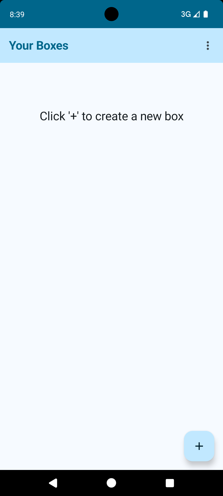<br />
      <sub><b>When first opening the app it is empty.</b></sub>
    </td>
    <td align="center">
      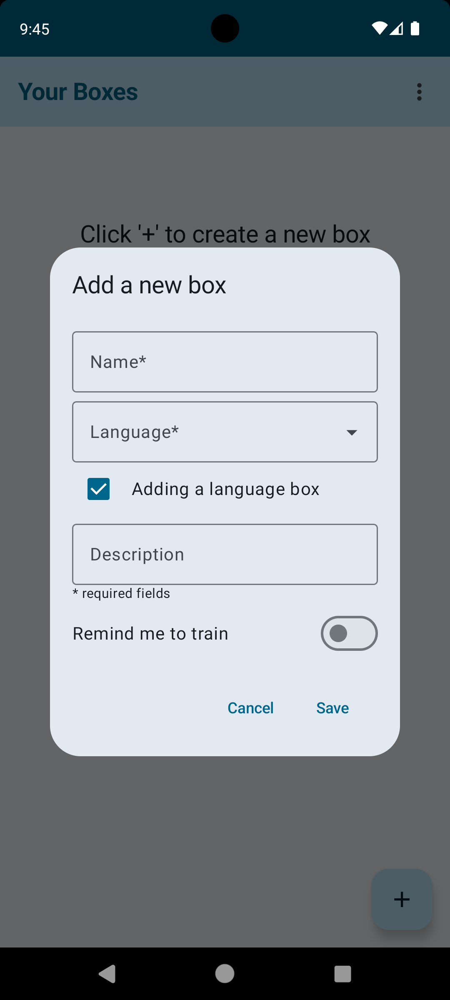<br />
      <sub><b>A box can be added by tapping the '+' icon and its details can be entered.</b></sub>
    </td>
    <td align="center">
      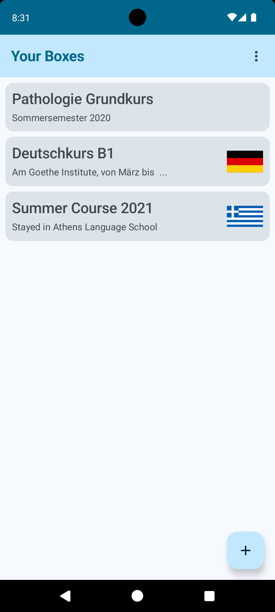<br />
      <sub><b>The home screen after adding several boxes.</b></sub>
    </td>
  </tr>
</table>

From the options on the top right of the home screen you can access the settings screen and also start the tutorial (work in progress):

<table>
  <tr>
    <td align="center">
      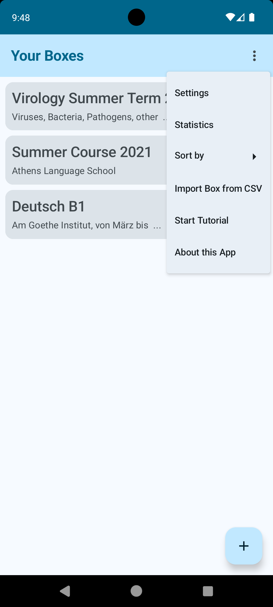<br />
      <sub><b>The options available on the home screen.</b></sub>
    </td>
    <td align="center">
      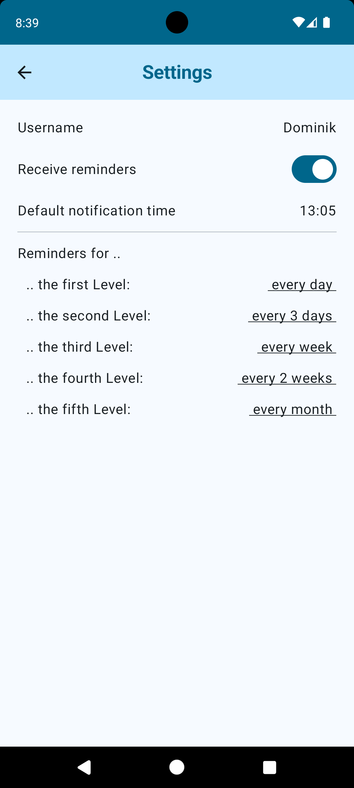<br />
      <sub><b>The seetings screen.</b></sub>
    </td>
    <td align="center">
      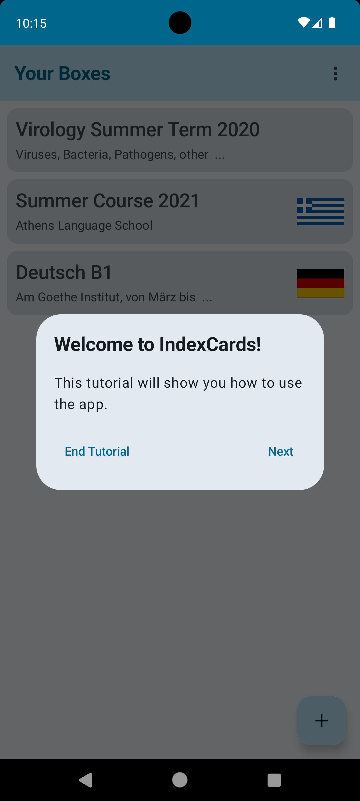<br />
      <sub><b>The first tutorial dialog.</b></sub>
    </td>
  </tr>
</table>

Clicking on a box on the home screen reveals it contents:

<table>
  <tr>
    <td align="center">
      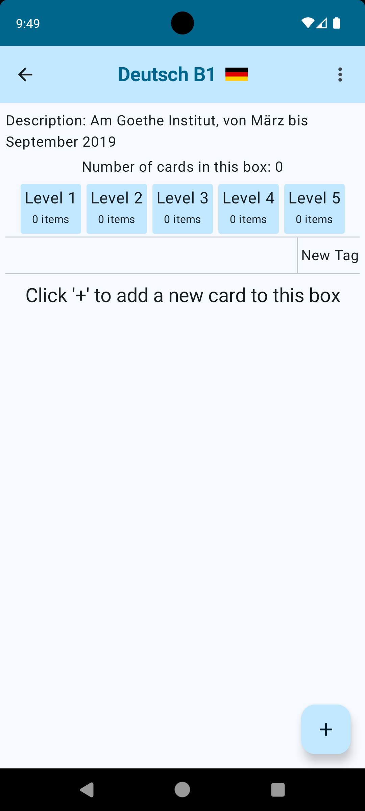<br />
      <sub><b>When first opening a box it is empty.</b></sub>
    </td>
    <td align="center">
      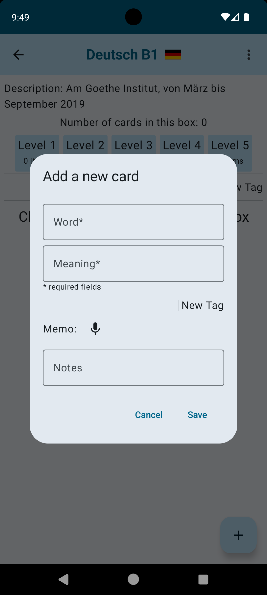<br />
      <sub><b>The dialog for adding a new card to the current box.</b></sub>
    </td>
    <td align="center">
      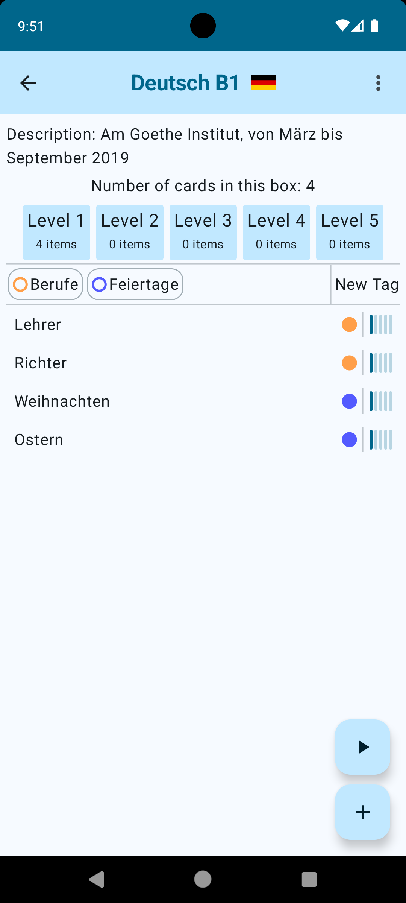<br />
      <sub><b>The box screen after adding several cards.</b></sub>
    </td>
  </tr>
</table>

Cards can be associated with tags and have a level according to how often in a row you have got them correct during training. When you get a card right, it moves up one level; getting a card wrong decreases its level. Higher levels have to be trained less often.

<table>
  <tr>
    <td align="center">
      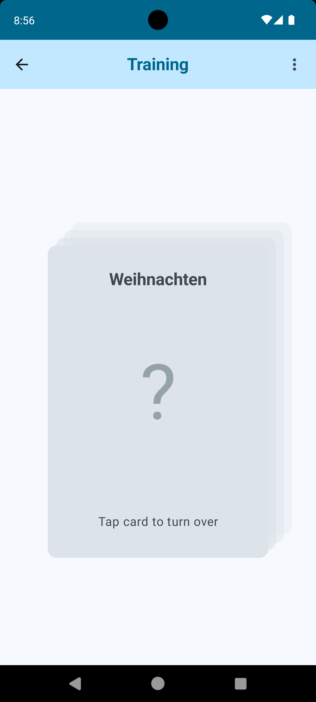<br />
      <sub><b>During training cards are first shown with the answer covered.</b></sub>
    </td>
    <td align="center">
      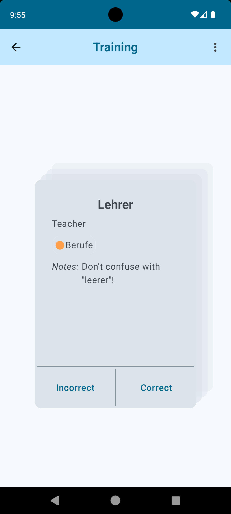<br />
      <sub><b>Tapping on the card revels the answer from where you select if you got it correct or not.</b></sub>
    </td>
    <td align="center">
      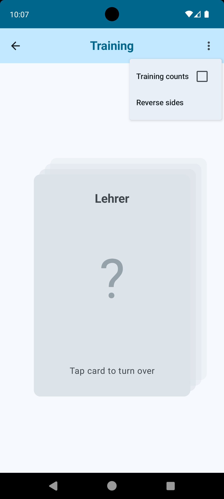<br />
      <sub><b>The faces/sides of the cards can also be reversed.</b></sub>
    </td>
  </tr>
</table>

The options on the box screen let you search for a keyword, sort cards, enter training, and edit the box details:

<table>
  <tr>
    <td align="center">
      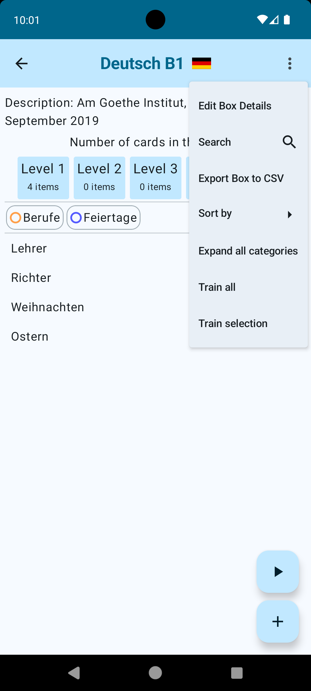<br />
      <sub><b>The options available on the box screen.</b></sub>
    </td>
    <td align="center">
      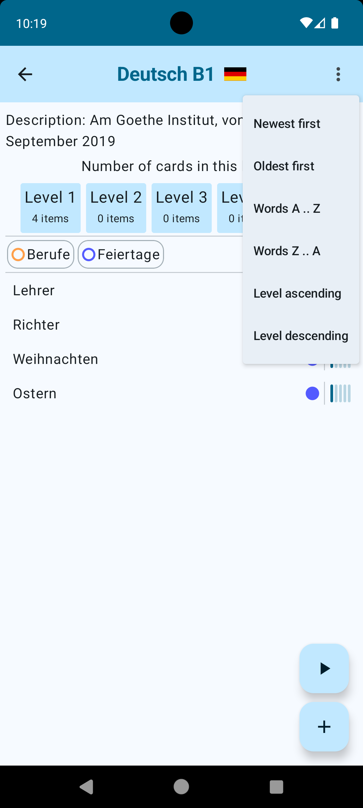<br />
      <sub><b>There are several sorting options available.</b></sub>
    </td>
    <td align="center">
      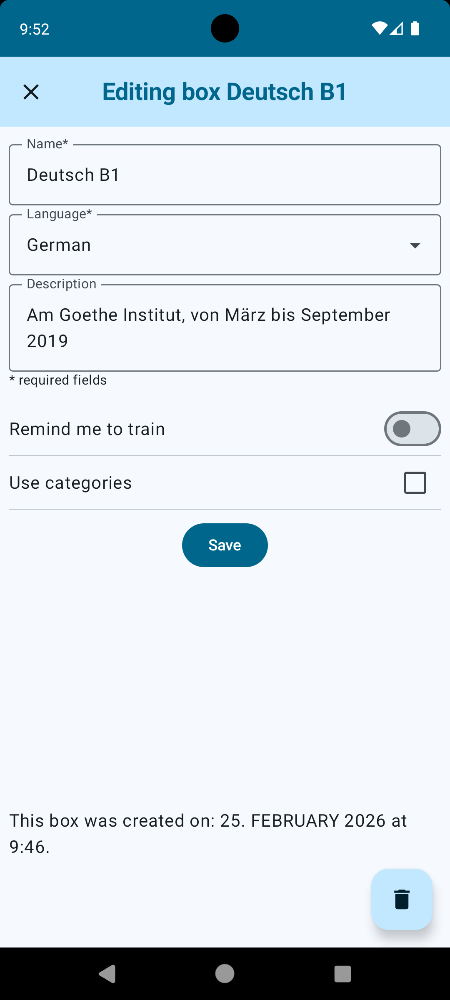<br />
      <sub><b>The screen for editing a boxes details.</b></sub>
    </td>
  </tr>
</table>


## Features

- Learning languages 
- Tutorial (work in progress)
- Reminders for training as notifications (still some bugs)
- User preferences
- Exporting to and importing from CSV files

## Languages

The UI of the app is available in English and German. There following languages are supported with flags to select as a language box:

- Albanian
- Arabic
- Chinese
- Croatian
- Danish
- English
- Estonian
- Finnish
- French
- German
- Greek
- Hebrew
- Hungarian
- Icelandic
- Italian
- Japanese
- Korean
- Latin
- Norwegian
- Persian
- Portuguese
- Russian
- Spanish
- Swedish
- Turkish

## Technical Details

This app is written entirely in [Kotlin](https://kotlinlang.org/). It uses [Compose](https://developer.android.com/compose) for the UI and [Room](https://developer.android.com/training/data-storage/room/) for persistent storage of data. Other modules used are the [colopicker-compose by skydoves](https://github.com/skydoves/colorpicker-compose) and [datastore](https://developer.android.com/topic/libraries/architecture/datastore) for storing preferences.

Boxes, cards, tags, and categories are stored in a relational SQLite database.

## Developer Information

To create a new release, the main branch has to be tagged and then pushed

```
git tag -a v1.0 -m "First release"

git push origin v1.0
```
